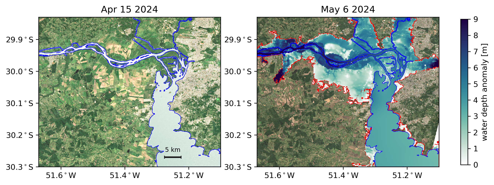

# SWOT - 2024 South Brazil Flooding Analysis

This repository contains code and resources for analyzing the severe flooding event that affected southern Brazil in May 2024. The project integrates various datasets and methods to assess the flood's scope, volume, and impact, as well as the extreme rain events and large-scale atmospheric conditions driving the phenomenon.

The code in this repository supports the research for the paper:

**Title:** SWOT Satellite Reveals Devastating Flood Impact in Rio Grande do Sul, Brazil  
**Journal:** Geophysical Research Letters  
**Status:** Submitted

## Overview

The flood in southern Brazil, particularly in Porto Alegre, was a significant event with widespread devastation. This project focuses on:

- Analyzing water depth anomalies before and after the flood.
- Estimating the floodwater volume and its impact on affected areas.
- Utilizing satellite observations to enhance flood monitoring and research.
- Analyzing extreme rain events and large-scale atmospheric conditions that contributed to the flood.

## Datasets

We used a range of datasets to conduct our analysis:

- **Sentinel-2 Data:** Bands B2 (blue), B3 (green), B4 (red), and the Scene Classification Map (SCL) with spatial resolutions of 10 meters and 20 meters, respectively.
- **SWOT Data:** High-density pixel cloud data accessed via the `EarthAccess` Python package. We filtered pixels with a water fraction above 0.1, classified as open water, water near land, or dark water.
- **HIDROWEB Data:** Water level and precipitation measurements from gauge stations `Cais Mauá C6` and `Terminal CATSUL Guaíba` provided by Brazil's National Water Agency.
- **FABDEM Data:** Forest And Buildings removed Copernicus Digital Elevation Model (FABDEM) with one arc-second grid spacing, used to analyze terrain characteristics and estimate water depth anomalies.
- **MERRA-2 Data:** Half-degree hourly global reanalysis data for air temperature, total precipitable water vapor, and wind speeds at 10 meters.
- **IMERG Data:** Half-hourly precipitation data at 0.1-degree resolution from the Integrated Multi-satellitE Retrievals for Global Precipitation Measurements dataset.
- **BDMEP Data:** Precipitation records from conventional and automatic meteorological stations in Rio Grande do Sul, maintained by the Brazilian National Institute of Meteorology (INMET) [BDMEP](https://bdmep.inmet.gov.br/).
- **ENSO 3.4 Index:** Monthly index data from NOAA Physical Sciences Laboratory (PSL) [ENSO 3.4 Index](https://psl.noaa.gov/data/correlation/nina34.anom.data).
- **IPH Data:** Shapefile of an interactive map developed by the Institute of Hydraulic Research (IPH) of the Federal University of Rio Grande do Sul (UFRGS), validated against field survey data.
- **Socioeconomic Data:** Social vulnerability index, total population, and vulnerable population by human development zone from the Social Vulnerability Atlas provided by the Institute of Applied Economic Research.

## Analysis of Extreme Rain Events and Atmospheric Conditions

In addition to flood extension and volume analysis, we performed an in-depth examination of extreme rain events and the large-scale atmospheric conditions that contributed to the flooding:

- **Extreme Rain Events:** Analyzed precipitation data from the BDMEP and IMERG datasets to identify patterns and intensities of extreme rainfall leading up to and during the flood.
- **Atmospheric Conditions:** Examined MERRA-2 reanalysis data to understand large-scale atmospheric drivers such as air temperature, total precipitable water vapor, and wind speeds that influenced the flood event.
- **Climatic Influences:** Explored potential climatic factors affecting the flood using the ENSO 3.4 index, including the impact of El Niño or La Niña conditions.

## Features

- **Data Analysis:** Code to process and analyze the datasets mentioned above.
- **Extreme Event Analysis:** Scripts to examine extreme rainfall and atmospheric conditions.
- **Visualization:** Scripts to generate visualizations such as water depth anomaly maps and atmospheric condition graphs.
- **Flood Volume Estimation:** Methods for calculating floodwater volume using integrated satellite and topographic data.

## Example

*Before and After water depth anomaly for the extreme flood*

